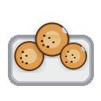
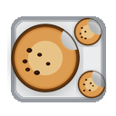
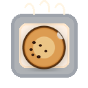
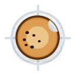
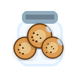

# Eat My Cookies


Cookie banners are annoying. Eat My Cookies is a free Chrome extension that handles them based on your preferences, so you don't have to fix them site by site. No backend, no tracking, no ads. Just goodness, like what cookies should really be: a delicious real one.

If Eat My Cookies saves you time, please consider supporting it:

[](https://ko-fi.com/eatmycookies)
[](https://github.com/sponsors/eatmycookies-dot-net)

A lot of hours went into getting real-world sites and weird CMP edge cases to behave properly, and support helps justify keeping that maintenance work going.

It runs locally in the browser, applies the preference you choose, keeps a running count of what it handled for you, and is honest when a site needs a special-case flow instead of pretending everything is solved.

## What It Does

- Handles common cookie consent technologies: Sourcepoint, OneTrust, Cookiebot, Didomi, Usercentrics, Quantcast Choice, TrustArc, Axeptio, CookieYes, Termly, Iubenda, CookieScript, ConsentManager, Shopify Customer Privacy, Klaro, Ketch, AppConsent, and custom site-specific flows.
- Supports `Reject All`, `Accept All`, and a `Custom` mode for per-category preferences (Functional, Analytics, Advertising, Uncategorized/Custom Purposes), plus a top-level `CCPA: Do not sell/share` toggle.
- Handles geo-specific redirect flows — sites that send visitors to a dedicated consent settings page (e.g. DW.com) can be completed inline, with extension-initiated detours returned to content automatically while intentional user-opened privacy pages remain accessible.
- Uses publisher-owned privacy APIs and shared first-party signals when that path is safer than banner clicking, including BBC's Sourcepoint US privacy flow and LA Times' `rdp` / `c_rdp` CCPA path.
- Falls back to site-specific warning flows when a publisher only exposes accept-or-pay style choices.
- Tracks recent activity, total handled prompts, and collectible cookie badges.
- Site exceptions let you disable the extension on individual domains or always accept on specific sites.
- Popup and context-menu UI now support autodetected language with an optional manual override.
- Packages cleanly for local loading and Chrome Web Store submission.

## Support Status

Current publisher support and caveats are tracked in [docs/site-support-matrix.md](docs/site-support-matrix.md).
That file is the best snapshot for questions like:

- which sites are currently solid
- which ones are automation-covered but still worth human checking
- which ones are intentionally limited to honest warning flows
- which ones still need direct implementation work

## Philosophy

- Privacy-first: prefer the most restrictive safe choice that matches the user setting.
- Honest about limits: if a site only exposes accept-or-pay or otherwise unsafe paths, the extension warns instead of faking success.
- API-first when possible: if a CMP exposes a reliable page API, that is preferred over brittle selector clicking.
- Narrow fixes over broad guesses: publisher-specific edge cases are scoped carefully so one site fix does not break another.

## Visuals

### Extension Icon


### Cookie-Eating Animation

The toolbar icon now uses a longer bite animation so the count change is more noticeable.

| 1 | 2 | 3 | 4 |
| --- | --- | --- | --- |
|  |  |  |  |

| Reset |
| --- |
|  |

### Badge Collection

| First Bite | Baker's Dozen | Quarter Crunch | Fifty Stack |
| --- | --- | --- | --- |
|  |  |  |  |

| Snack Attack | Century Crumbler | Double Dip | Tray Tracker |
| --- | --- | --- | --- |
|  |  |  |  |

| Oven Regular | Cookie Crusher | Terminator | Jar Raider |
| --- | --- | --- | --- |
|  |  |  |  |

| Batch Boss | Crate Cracker | Unstoppable | Legend |
| --- | --- | --- | --- |
|  |  |  |  |

| Scroll Stomper | Bannerbreaker | Consent Cartographer |
| --- | --- | --- |
|  |  |  |

| Wall Whisperer | Crumb Colossus | Mythic Muncher |
| --- | --- | --- |
|  |  |  |

### Milestone Ladder

The badge system now keeps going well beyond the early milestones so active users do not hit a hard ceiling quickly.

| Threshold | Badge | Image |
| --- | --- | --- |
| 1 | First Bite | `icons/badges/first-bite.png` |
| 12 | Baker's Dozen | `icons/badges/bakers-dozen.png` |
| 25 | Quarter Crunch | `icons/badges/quarter-crunch.png` |
| 50 | Fifty Stack | `icons/badges/fifty-stack.png` |
| 75 | Snack Attack | `icons/badges/snack-attack.png` |
| 100 | Century Crumbler | `icons/badges/century-crumbler.png` |
| 200 | Double Dip | `icons/badges/double-dip.png` |
| 300 | Tray Tracker | `icons/badges/tray-tracker.png` |
| 400 | Oven Regular | `icons/badges/oven-regular.png` |
| 500 | Cookie Crusher | `icons/badges/cookie-crusher.png` |
| 1,000 | Terminator | `icons/badges/terminator.png` |
| 2,000 | Jar Raider | `icons/badges/jar-raider.png` |
| 3,000 | Batch Boss | `icons/badges/batch-boss.png` |
| 4,000 | Crate Cracker | `icons/badges/crate-cracker.png` |
| 5,000 | Unstoppable | `icons/badges/unstoppable.png` |
| 10,000 | Legend | `icons/badges/legend.png` |
| 25,000 | Scroll Stomper | `icons/badges/scroll-stomper.png` |
| 50,000 | Bannerbreaker | `icons/badges/bannerbreaker.png` |
| 100,000 | Consent Cartographer | `icons/badges/consent-cartographer.png` |
| 250,000 | Wall Whisperer | `icons/badges/wall-whisperer.png` |
| 500,000 | Crumb Colossus | `icons/badges/crumb-colossus.png` |
| 1,000,000 | Mythic Muncher | `icons/badges/mythic-muncher.png` |

## How It Works

The extension uses a layered approach:

1. Page-world hooks for CMP APIs and consent frameworks.
2. Cross-frame handlers for consent UIs rendered inside iframes.
3. DOM selector rules from [`rules/cmps.json`](rules/cmps.json).
4. Heuristic fallbacks for simpler banners.
5. Site-specific overrides for publishers with unusual or paywall-like consent flows.

When a site cannot be configured safely under the current preference, the popup shows a `!` warning and offers a site-specific `Always accept here` override instead of pretending the banner was handled.

For tricky sites, the project tries to distinguish between:

- consent recorded successfully
- banner or overlay actually dismissed for the user

Those are not always the same thing, especially for cross-origin iframe CMPs such as Sourcepoint.

## Privacy

- No backend.
- No account.
- No analytics service.
- Preferences and stats are stored in Chrome extension storage on the user’s machine.

## Local Development

### Requirements

- Node.js

### Install

```bash
npm install
```

### Build

```bash
npm run build
```

This generates a fresh unpacked extension in `dist/`.

### Quick Verify

For the normal contributor sanity check, run:

```bash
npm run verify
```

This runs:

- `npm run build`
- `npm run test:static`

It does not run unit tests or live browser e2e validation.

### Submission Zip

```bash
npm run build:zip
```

This performs a fresh build and writes the Chrome Web Store upload package to `releases/`.

### Regenerate Icons

This is a one-off asset generation tool, not part of the normal dev/test/build loop.
It stays in Python because the raster drawing logic is compact and dependency-light with Pillow, while the rest of the project remains Node-based.

Requirements for this step only:

- Python 3
- Pillow

```bash
python3 -m pip install -r scripts/requirements-icons.txt
npm run icons
```

### Regenerate Chrome Web Store Assets

The listing screenshots and promo tiles are tracked in [`chromeweblisting/`](chromeweblisting/).
Their generator lives in [`scripts/generate-chromeweblisting-assets.mjs`](scripts/generate-chromeweblisting-assets.mjs), which fits the same repo convention as the build and icon-generation scripts.

```bash
npm run listing:assets
```

This refreshes:

- the raw UI captures in `chromeweblisting/raw/`
- the five `1280x800` listing screenshots
- the `440x280` small promo tile
- the `1400x560` marquee promo tile

### Run Tests

```bash
npm run test
```

This runs:

- unit tests
- static validation checks

It does not run live browser e2e validation.

To run live browser validation against real sites, use:

```bash
npm run test:e2e
```

Useful variants:

```bash
npm run test:e2e:headed
npm run test:e2e:eu
npm run test:e2e:us
npm run test:e2e -- --site="The Guardian (US/CCPA)"
```

The Guardian US validation now exercises a second in-site navigation in `reject_all`
mode and fails if the browser lands on `/help/accessibility-help`, so follow-up
redirect regressions are covered instead of only the first page load.

For most day-to-day changes, prefer `npm run verify` first and use the live Playwright validation commands when you specifically need site-flow coverage.

### Locale-Aware Validation

`tests/sites.json` supports per-site locale metadata so live validation can exercise localized CMP text and buttons more realistically.

Supported fields:

- `locale`
- `acceptLanguage`

Example:

```json
{
  "name": "Le Parisien",
  "url": "https://www.leparisien.fr/",
  "region": "EU",
  "locale": "fr-FR",
  "acceptLanguage": "fr-FR,fr;q=0.9,en;q=0.8"
}
```

The validator uses those values to:

- send an `Accept-Language` header for the page
- override `navigator.language` and `navigator.languages` before site scripts run

That is especially useful for multilingual CMPs such as Didomi, Sourcepoint, OneTrust, and TrustArc where labels can differ significantly by locale.

### UI Localization

The extension uses Chrome `_locales` catalogs for shipped UI strings and a small shared helper in [`utils/i18n.js`](utils/i18n.js) so popup and context-menu copy stay in sync.

Important: `_locales` only cover extension UI. If you add a new supported language, also update the language-aware consent matching in `content/*.js` and extend the locale regression tests so UI support and banner-handling support do not drift apart.

The user-facing language setting supports:

- `Auto`
- `EN`
- `FR`
- `DE`
- `ES`
- `IT`
- `PT`

### Recommended Contributor Workflow

For most contributors, the intended order is:

1. `npm run verify`
   Use this after normal edits to confirm the extension still builds and passes static checks.
2. `npm run test`
   Run this when you changed runtime logic, storage logic, popup behavior, or anything covered by unit tests.
3. `npm run test:e2e -- --site="..."`
   Run this when you changed a real site flow or a CMP integration and need live browser coverage.

Use `npm run test:all` only when you explicitly want the full suite, including live-site validation.

## Adding Site Support

The safest order for new site work is:

1. Identify the real CMP vendor and whether the relevant UI lives in the top page, an iframe, or both.
2. Check whether the site exposes a CMP API before adding selectors.
3. Prove the winning manual action on the live site.
4. Confirm whether success means both “consent saved” and “banner actually gone.”
5. Validate the site in its real locale when button copy changes by language.
5. Add the narrowest possible handler and then cover it with tests.

In practice, API-first paths tend to be more stable than large selector piles, especially for iframe-based CMPs with their own state machines.

## Release Workflow

Build a store-ready zip into `releases/`:

```bash
npm run build:zip
```

Release notes live in [`releases/README.md`](releases/README.md).

## Contributing

Contributor workflow notes live in [`CONTRIBUTING.md`](CONTRIBUTING.md).

## Project Structure

```text
background/   MV3 service worker, badge updates, context menu, storage plumbing
content/      Main runtime, CMP handlers, iframe handlers, heuristics
popup/        Popup UI, recent activity, badges, site exceptions
onboarding/   First-run setup flow
rules/        CMP selector database
scripts/      Build and icon generation scripts
tests/        Live-site Playwright validation
releases/     Versioned release zips and notes
```

## Notes

Cookie banners are highly dynamic, geo-dependent, and often A/B tested. A site that works in one region or mode may present a different flow elsewhere, so the project uses a mix of generic handlers and targeted publisher logic to stay resilient.

For EU publishers in particular, US-origin testing is often directionally useful but not authoritative. When validating support claims or regressions, prefer an EU IP/VPN path whenever possible.

## Changelog

See [`releases/README.md`](releases/README.md) for per-version release notes.

---

Made by [Eat My Cookies](https://eatmycookies.net) · support@eatmycookies.net
